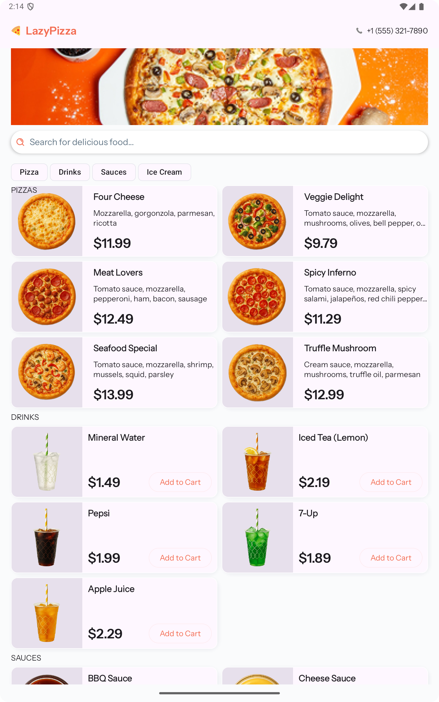
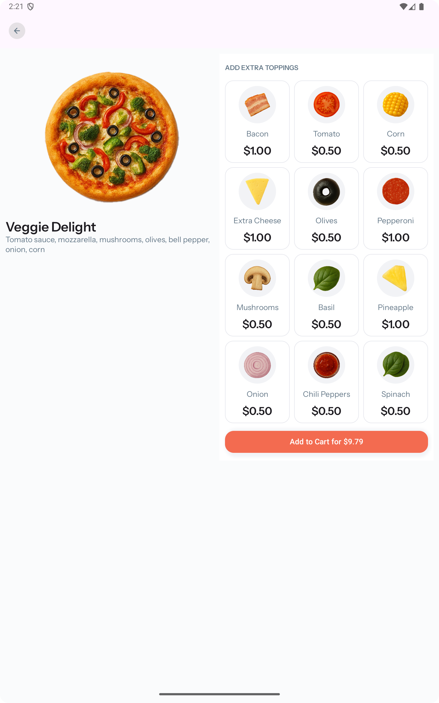
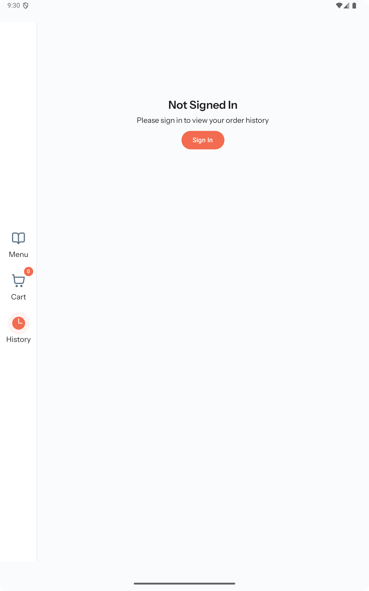
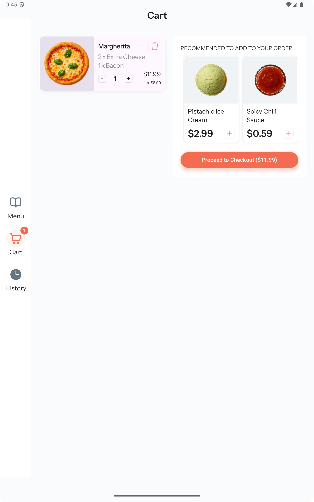
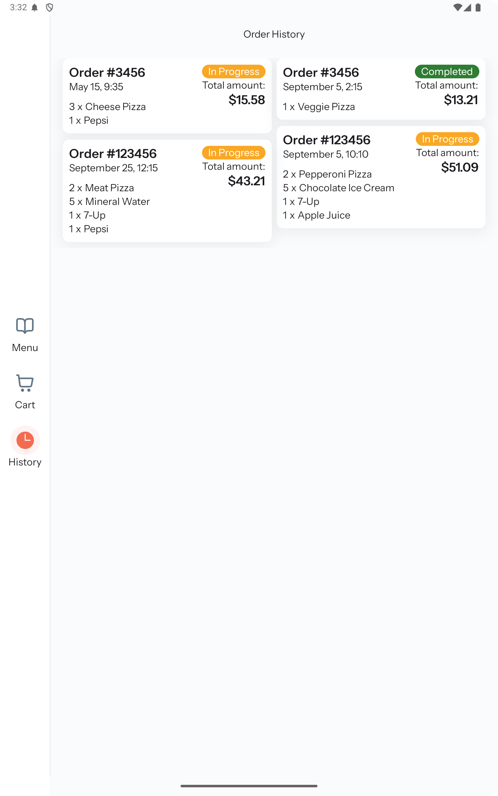
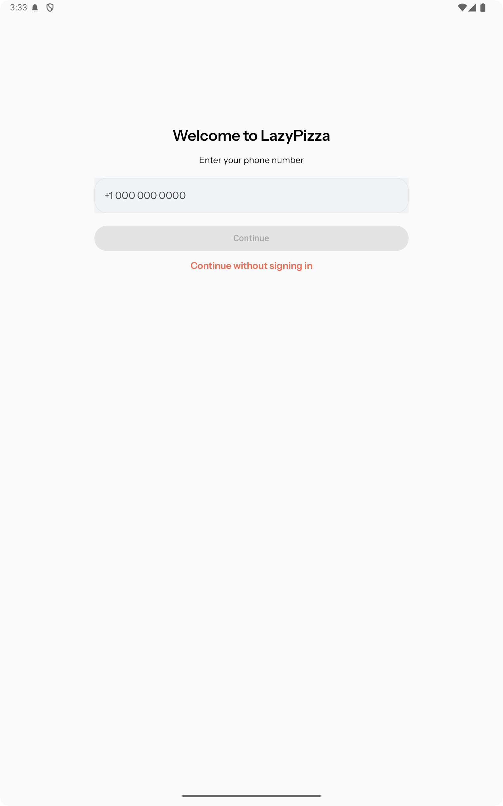

# LazyPizza
Android Application for Pizza Orders

## Screenshots

    
    
    
    
    
    

## Walkthroughs

    
    
    

### Notes
* `io.coil-kt.coil3:coil-network-okhttp` is needed to get `AsyncImage` working with `coil`.
* **If your preview does not seem to be depicting the correct color for your `MaterialTheme` in the preview window, then make sure you are wrapping your preview in your theme block (i.e. `LazyPizzaTheme { ... }`).**
* **If a join returns all null results all of the values in the object used for deserialization have to be nullable or it wlll crash the app!**
* If you use a key for something like `LazyVerticalGrid`, make sure your keys are all unique for the preview.
  * Otherwise the preview will not work.
* If you have a `lazy` component inside another lazy commpoent, make sure the inner one has either a `height` or `heightIn` so the outer component can render. Otherwise it does not know enought to render the correct height.

### Ktlint
* `./gradlew ktlintCheck` - generate reports
* `./gradlew ktlintFormat` - format code

### Add Firebase Storage
* Run through the setup: https://firebase.google.com/docs/storage/android/start
* Add your config file here: `app/google-services.json`
  * Add this to .gitignore (at least for now).
* Console: https://console.firebase.google.com
* Storage: https://console.firebase.google.com/project/lazypizza-22122/storage/lazypizza-22122.firebasestorage.app/files

### Generate SHA-256 Key
* `./gradlew signingReport`

### Convert Video Format
* https://ffmpeg.org/ffmpeg.html#Video-and-Audio-file-format-conversion
* `ffmpeg -i milestone_one.webm -c:v libx264 milestone_one.mp4`

### Ktlint Plugin
* https://plugins.jetbrains.com/plugin/15057-ktlint

### Resources
* [Font](https://fonts.google.com/specimen/Instrument+Sans)
* https://firebase.google.com/docs/storage/android/start
* [Image Caching with Coil Compose - Everything You Need to Know](https://www.youtube.com/watch?v=qQVCtkg-O7w)
* [Async with Token](https://github.com/coil-kt/coil/discussions/2558#discussioncomment-10963528)
* [Room Relationship](https://proandroiddev.com/room-database-relationships-explained-729d3c705fd9)
* [Understanding the internal of Flow, StateFlow, and SharedFlow](https://www.revenuecat.com/blog/engineering/flow-internals/)

### Provided Resources
* [Adding Shadows in Compose](https://developer.android.com/develop/ui/compose/graphics/draw/shadows)
* [State in Jetpack Compose](https://developer.android.com/codelabs/jetpack-compose-state#0)
* [Where to hoist state](https://developer.android.com/develop/ui/compose/state-hoisting)
* [Stateful vs Stateless Composables](https://www.youtube.com/watch?v=C8IfGDrmwiE)
* [How to Save & Restore the Scroll Position of a LazyColumn Persistently](https://www.youtube.com/watch?v=MeIGZ0trjG0)
* [How to Create a Lazy Column With Categories in Jetpack Compose](https://www.youtube.com/watch?v=XfYlRn_Jy1g&t=1s)
* [The Full Jetpack Compose Responsive UI Crash Course](https://www.youtube.com/watch?v=jU_BAQI4DiM)
* [Full Guide to Material3 Theming in Compose Multiplatform](https://www.youtube.com/watch?v=SH7HzLUjyBs)
* [Buttons - UX With Material3](https://www.youtube.com/watch?v=2y4XiyJv0pQ&list=PLQkwcJG4YTCT1LkjokmzZUFFyFVVWPuKk)
* [Create a Splash Screen in Compose Multiplatform for iOS & Android - KMP for Beginners](https://www.youtube.com/watch?v=q_JM6C_kFuY)
* [Connect your App to Firebase](https://firebase.google.com/docs/database/android/start)
* [Add Firebase to your Android project](https://firebase.google.com/docs/android/setup)
* [Visual Go](https://visualgo.net/en)
* [Stateful vs. Stateless Composables In Jetpack Compose? - Everything You Need to Know](https://www.youtube.com/watch?v=C8IfGDrmwiE)